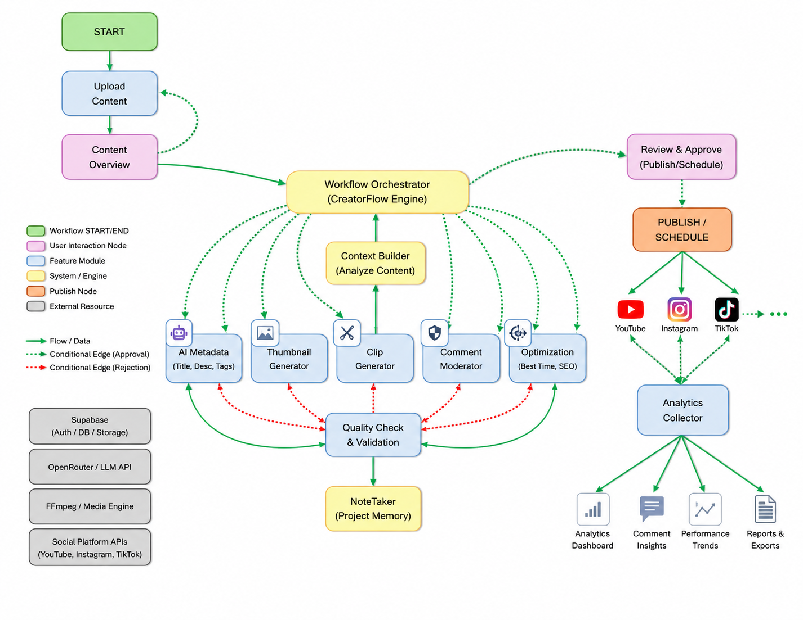

# CreatorFlow

Social media automation suite MVP — thumbnails, metadata/SEO, upload scheduling,
analytics, comment moderation, and clip generation in one dashboard.

## Workflow



Upload lands as a content asset, the orchestrator fans out to the five generation
modules (metadata, thumbnail, clip, comment moderation, optimization) with a quality
check/validation gate in front of each, then review/approve triggers publish across
platforms and analytics rolls back into the dashboard. The Pipeline tab in the
frontend renders this same flow per-asset, read from Supabase state — see
[Pipeline tab](#current-state) below for how it's wired today vs. the full diagram.

## Structure

```
frontend/            React + Vite + TypeScript SPA (Tailwind, React Query, recharts)
backend/
  supabase/
    migrations/         Postgres schema (§4 of the spec)
    functions/          Edge Functions, one per module — function -> service -> job
      _shared/            db/cors/job/openrouter helpers shared across functions
      platforms/          PlatformConnector interface + mock implementation
```

## Setup

Requires a Supabase project and the [Supabase CLI](https://supabase.com/docs/guides/cli).
CLI commands below run from `backend/` since that's where the `supabase/` dir lives.

```bash
# Backend
cd backend
supabase link --project-ref <your-project-ref>
supabase db push
supabase functions deploy

# Set secrets used by Edge Functions
supabase secrets set \
  SUPABASE_URL=... SUPABASE_ANON_KEY=... SUPABASE_SERVICE_ROLE_KEY=... \
  OPENROUTER_API_KEY=...

# Frontend
cd ../frontend
cp .env.example .env   # fill in VITE_SUPABASE_URL / VITE_SUPABASE_ANON_KEY
npm install
npm run dev
```

### AI features (OpenRouter)

All text-generation AI (currently: metadata/SEO title+description+tags) goes through
`backend/supabase/functions/_shared/openrouter.ts` using an `OPENROUTER_API_KEY` secret.
Defaults to `openai/gpt-4o-mini`; override with an `OPENROUTER_MODEL` secret if you want
a different model. Thumbnail generation and clip analysis are not text tasks and are
still stubbed (see below) — say the word if you want those wired to an OpenRouter
image-capable model too.

### Scheduled publishing

`supabase/functions/publish-due` publishes any `scheduled_posts` whose time has come.
Wire it to run on a schedule (e.g. `pg_cron` calling the function every minute, or a
Supabase scheduled function) — it is not called from the request path.

## Current state

Scaffold pass: schema, RLS policies, all six modules' Edge Functions, and the
frontend shell are in place with the job-polling pattern wired end-to-end.
Metadata generation calls OpenRouter for real. Media processing (thumbnail render,
ffmpeg clip analysis) is still stubbed — see `TODO` comments in
`backend/supabase/functions/{thumbnails,clips}-generate/index.ts`. Platform
publishing uses `MockConnector`; swap in a real `PlatformConnector` per platform
(YouTube first, per spec §7) in `backend/supabase/functions/platforms/`.
